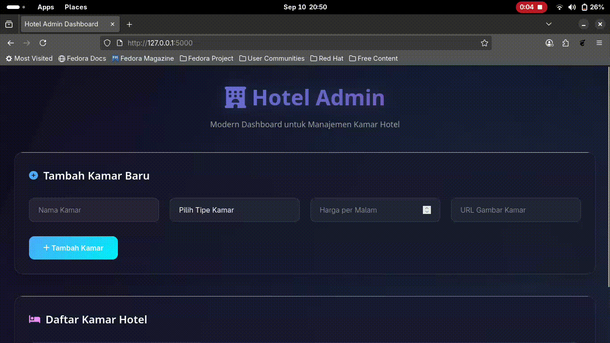

# 🏨 Hotel Room Management API + Admin Dashboard

Proyek ini adalah hasil dari **Test Assessment Junior Dev**.  
Aplikasi ini terdiri dari **backend API** untuk mengelola data kamar hotel dan **frontend dashboard admin** untuk berinteraksi dengan API tersebut.

---

## 🎯 Tujuan
Membuat backend sederhana untuk mengelola data kamar hotel (Hotel Room Management API) dan membangun UI dashboard admin dasar untuk berinteraksi dengan API tersebut.

---

## 📋 Fitur

### 🔹 Backend (Node.js + Express + MongoDB)
- `GET /rooms` → Mengembalikan daftar kamar dalam format JSON  
- `POST /rooms` → Menambahkan kamar baru (`name`, `type`, `price`)  
- `DELETE /rooms/:id` → Menghapus kamar berdasarkan ID  

### 🔹 Frontend (HTML, CSS, JavaScript)
- Menampilkan daftar kamar dari API menggunakan `fetch()`  
- Form untuk menambah kamar baru  
- Tombol hapus di setiap baris untuk menghapus kamar  
- Responsif (desktop & mobile)  

### 🌟 Bonus
- Field tambahan `imageURL`  
- Validasi form agar semua field wajib diisi  
- Desain UI mockup (opsional)  

---

## 🎥 Demo

### 🔹 Preview (GIF)


---

## ⚙️ Cara Menjalankan

### 1. Clone Repo
```bash
git clone https://github.com/rafly1012/hotel.git
cd hotel
npm install
